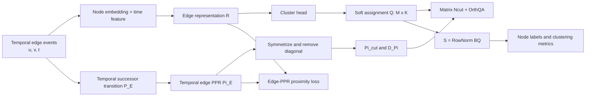

# ETGC 当前实现框架与代码细节

> 更新时间：2026-08-18<br>
> 适用分支：`exp/etgc-mainline-refine`<br>
> 基线提交：`2e154e7`<br>
> 本文基于当前工作区代码，其中包含尚未提交的 matrix-Ncut 主线统一修改。

## 1. 方法定位

ETGC 的基本建模对象不是去重后的静态边，而是 temporal edge event：

\[
e_i=(u_i,v_i,t_i),\qquad i=1,\ldots,M.
\]

即使两次交互拥有相同端点，只要它们是不同的记录，就仍然是两个不同的事件。当前实现中：

- 节点数为 \(N\)；
- temporal edge event 数为 \(M\)；
- 社区数 \(K\) 取自 `node2label.txt` 中不同标签的数量；
- edge assignment 为 \(Q\in\mathbb R^{M\times K}\)；
- node assignment 为 \(S\in\mathbb R^{N\times K}\)。

整体数据流如下：



## 2. 代码模块分工

| 文件 | 主要职责 |
|---|---|
| `edge_main.py` | CLI、路径解析、随机种子、启动日志和程序入口 |
| `edge_data.py` | temporal edge event 与 node label 加载 |
| `edge_time.py` | current timestamp / history 时间特征 |
| `edge_model.py` | node embedding、edge representation、cluster head、prototype 初始化 |
| `edge_proximity.py` | temporal successor、edge PPR、`Pi_cut`、cache |
| `edge_losses.py` | matrix Ncut、legacy cut、Orth/OrthQA、proximity、projection |
| `edge_train.py` | 初始化、两阶段训练、全量 global update、评估、结果输出 |
| `edge_uniform_diagnostic.py` | rank、margin、volume、gradient、collapse 诊断 |
| `edge_metrics.py` | Hungarian matching、ACC、NMI、ARI、Macro-F1 |

代码中的 `EdgeHiNoSModel`、`EdgeHiNoSTrainer` 和 `edge_hinos_Q.npy` 等名称是历史内部命名。当前方法名称统一为 **ETGC**。

## 3. 数据加载与事件语义

### 3.1 输入文件

每个数据集目录需要：

```text
dataset/<dataset>/<dataset>.txt
dataset/<dataset>/node2label.txt
```

edge 文件至少包含：

```text
source destination timestamp
```

加载过程具有以下行为：

1. 每一行有效交互都成为独立 event；
2. self-loop `u == v` 会被过滤；
3. 相同端点的重复交互不会合并；
4. 非连续 node ID 会映射为 `0 ... N-1`；
5. 所有节点必须有标签，否则直接报错；
6. 原始标签会重新映射为 `0 ... K-1`。

### 3.2 概念 incidence matrix

概念上定义 \(B\in\mathbb R^{N\times M}\)。event \(e_i=(u_i,v_i,t_i)\) 在节点 \(u_i,v_i\) 对应的两行各贡献一次。

代码不会显式构造 dense \(B\)，而是通过两次 `index_add` 或 `np.add.at` 完成：

\[
S_{\mathrm{raw}}=BQ,
\qquad
S=\operatorname{RowNorm}(S_{\mathrm{raw}}).
\]

重复 event 会重复贡献，因此 temporal interaction frequency 被保留下来。

## 4. 时间特征

### 4.1 `current`：当前主线默认

默认 `time_feature_mode=current`。对每个 event 只使用当前时间戳 \(t_i\)：

```text
[raw timestamp, Fourier(timestamp)]
```

当 `time_dim=32` 时，第一个维度是原始时间；代码调用 `TimeEncoder(31)` 生成 Fourier 部分并在不足 31 维时补零。按当前 frequency 数量计算，Fourier 部分实际包含 8 个 sin/cos 值和 23 个零填充维度。

这个模式不会使用前序历史统计，因此 edge representation 只依赖当前 event 的端点与当前时间。

### 4.2 `history`：兼容分支

history 分支先计算：

```text
current timestamp
time since source node last appeared
time since destination node last appeared
time since ordered pair last appeared
```

四个值随后一起进入 `TimeEncoder(time_dim)`。编码器会展平“四个时间量 × 每个时间量的 sin/cos 特征”，再裁剪或补零到恰好 `time_dim`，因此 history 分支最终维度仍然等于模型配置的 `time_dim`。

## 5. Node embedding

### 5.1 初始化来源

node embedding 查找顺序为：

1. 显式 `--feature_path`；
2. `pretrain/<dataset>_feature.emb`；
3. `emb/<dataset>_feature.emb`；
4. `emb/<dataset>/<dataset>_feature.emb`。

如果文件不存在：

- `require_pretrained_node2vec=1`：直接报错；
- 否则使用由 `model_seed` 控制的 Gaussian random fallback。

### 5.2 训练模式

| `node_emb_mode` | 行为 |
|---|---|
| `frozen` | node embedding 不参与梯度更新 |
| `small_lr` | node embedding 使用 `node_emb_lr`，其他参数使用主学习率 |
| `full` | 所有参数使用主学习率 |

当前 CLI 默认是：

```text
node_emb_mode=small_lr
learning_rate=1e-4
node_emb_lr=1e-5
```

优化器为 Adam，并检查不同 parameter group 中不能重复包含同一参数。

## 6. Edge representation

### 6.1 `direct_node_time`：当前默认

对 event \(e_i=(u_i,v_i,t_i)\)：

\[
r_i=[h_{u_i}\Vert h_{v_i}\Vert \gamma\phi(t_i)],
\]

其中：

- \(h_u,h_v\) 是 node embedding；
- \(\phi(t_i)\) 是时间特征；
- \(\gamma=\texttt{direct_time_scale}\)，默认 1；
- 输出维度是 `2 * node_dim + time_dim`；
- 不经过 edge MLP。

一个容易忽略的实现细节是：该模式始终按 `[source, destination, time]` 拼接。即使 `directed=0`，也没有对 source/destination 做交换不变处理。

### 6.2 `mlp`：兼容/实验分支

有向图使用：

\[
x_i=[h_u\Vert h_v\Vert \phi(t_i)].
\]

无向图使用对称 pair feature：

\[
x_i=[h_u+h_v\Vert |h_u-h_v|\Vert h_u\odot h_v\Vert \phi(t_i)].
\]

然后经过：

```text
Linear -> ReLU -> Linear -> ReLU
```

得到固定 `edge_dim` 的 event representation。

## 7. Cluster head 与 Q

### 7.1 `cosine_prototype`：当前 CLI 默认

该 head 没有 bias。对 event representation 和每个 prototype 分别 L2 normalize：

\[
z_{ik}=\frac{\hat r_i^\top\hat c_k}{\tau},
\qquad
Q_i=\operatorname{softmax}(z_i),
\]

其中默认温度 \(\tau=0.2\)。

在这个 head 下：

- `cluster_output_bias_mode` 不生效，因为 head 始终无 bias；
- `cluster_input_norm=layernorm` 不生效，输入直接进入 cosine head；
- cluster weight 的每一行表示一个 prototype direction。

### 7.2 `legacy_mlp`

结构为：

```text
optional LayerNorm
Linear(cluster_input_dim, cluster_hidden_dim)
ReLU
Linear(cluster_hidden_dim, K)
softmax
```

只有这个 head 支持：

- `cluster_input_norm=layernorm`；
- `cluster_output_bias_mode=default / zero / none`。

`LayerNorm` 使用 `elementwise_affine=False`，即只标准化，不额外学习 scale/bias。

### 7.3 Q 的形状与含义

无论使用哪种 head：

\[
Q=\operatorname{softmax}(Z),\qquad Q\in\mathbb R^{M\times K}.
\]

每一行是一个 temporal edge event 的 soft cluster probability。

## 8. Cluster initialization

实现支持以下初始化语义：

| 模式 | 实际操作 |
|---|---|
| `random` | 保留 PyTorch 随机初始化 |
| `random_orthogonal` | 用 QR 构造归一化 cluster weight |
| `random_event` | 随机选择 K 个 event hidden vector |
| `kmeans_plus_plus` | KMeans++ 选择中心，不做 Lloyd refinement |
| `prototype` | KMeans++ 后继续执行配置数量的 Lloyd iterations |

实际初始化的始终是最终 `cluster_output.weight`：

- legacy MLP：初始化最后一层 `Linear(cluster_hidden_dim, K)` 的 weight；
- cosine head：初始化 \(K\times d\) prototype weight。

初始化 feature 来源：

- legacy MLP：ReLU 后的 `cluster_hidden`；
- cosine head：归一化后的 edge representation \(\hat R\)。

### 8.1 两套参数的选择规则

- `cosine_prototype` 读取 `prototype_init_mode`；
- `legacy_mlp` 读取 `cluster_init_mode`。

当前 cosine head 默认：

```text
prototype_init_mode=kmeans_plus_plus
prototype_sample_size=20000
```

代码中 `kmeans_plus_plus` 分支调用 `lloyd_iters=0`。只有 `prototype` 语义会使用 `prototype_lloyd_iters`。

### 8.2 warmup 后延迟初始化

当同时满足：

```text
cluster_head_type=cosine_prototype
prototype_init_mode=kmeans_plus_plus
prox_warmup_epochs>0
```

prototype 初始化会延迟到第一次 global cluster update 前。这样 KMeans++ 使用的是经过 proximity warmup 后的 representation，而不是模型刚创建时的 representation。

## 9. Temporal edge PPR

### 9.1 Temporal successor transition `P_E`

对 event \(e_i\)，代码分别沿 source endpoint 和 destination endpoint 查找未来 event：

```text
same endpoint
later timestamp, or same timestamp but larger event id
```

候选 successor 权重为：

\[
w_{ij}\propto \exp[-\beta\max(t_j-t_i,0)].
\]

source 与 destination 两侧各分配 0.5 的概率质量，最后再做 row normalization。

`edge_neighbor_k<=0` 表示使用所有未来 successor；正值则限制每个 endpoint 上保留的 successor 数量。

### 9.2 Raw temporal edge PPR `Pi_E`

默认：

```text
edge_ppr_method=temporal_state_forest
alpha=0.2
beta=5.0
forest_samples=50
```

主实现使用 state-expanded temporal subdivision forest。代码还保留：

- `forest`：同一 state-expanded 实现的 alias；
- `legacy_temporal_forest`：旧 original-node forest；
- `truncated`：有限步 PPR。

输出的 `Pi_E` 是 raw temporal edge PPR，主要有两个用途：

1. 为 proximity loss 提供 event 邻居和权重；
2. 进一步构造 Ncut affinity。

### 9.3 Cache

`P_E`、`Pi_E` 和 cut affinity 都保存为 SciPy sparse `.npz`。cache key 包括：

```text
dataset, method, alpha, T, forest_samples,
edge_neighbor_k, edge_ppr_topk, beta, seed,
num_events, forest implementation
```

cut affinity 的 cache key还包括 `affinity_sparsify`。

## 10. Ncut affinity：`Pi_E -> Pi_cut -> D_Pi`

理论 Ncut 不直接使用可能非对称的 raw PPR。当前主线定义：

\[
\Pi_{\mathrm{cut}}
=\frac{1}{2}(\Pi_E+\Pi_E^\top),
\qquad
\operatorname{diag}(\Pi_{\mathrm{cut}})=0.
\]

代码语义为：

```text
Pi_E   = raw temporal edge PPR
Pi_cut = symmetric edge-PPR affinity used as Pi in Ncut
D_Pi   = row-sum degree of Pi_cut
```

不会显式创建 dense degree matrix。只保存：

\[
d=\Pi_{\mathrm{cut}}\mathbf 1,
\]

然后使用 `degree[:, None] * Q` 计算 \(D_\Pi Q\)。

### 10.1 Sparsification

- `edge_ppr_topk <= 0`：返回完整的 symmetrized `Pi_cut`；
- `edge_ppr_topk > 0` 且 `symmetric_union_knn`：一侧选中邻居即可保留无向 pair，输出仍对称；
- `row_topk` 仍作为兼容选项存在，但它可能破坏对称性，不应作为理论 matrix-Ncut 主线配置；
- `none`：不执行额外 affinity sparsification。

内部仍保留 `W_E` 属性和结果字段作为旧日志兼容 alias；其当前实际对象就是 `Pi_cut`。

## 11. 当前主 cut：完整 matrix-Ncut C-form

当前默认：

```text
ncut_scope=global
cluster_loss_type=matrix_ncut
```

定义：

\[
A=Q^\top D_\Pi Q+\epsilon I,
\]

\[
B=Q^\top(D_\Pi-\Pi_{\mathrm{cut}})Q,
\]

\[
L_{\mathrm{cut}}=\operatorname{Tr}(A^{-1}B).
\]

代码计算顺序：

```python
PiQ = sparse_mm(Pi_cut, Q)
DQ = degree[:, None] * Q
A = Q.T @ DQ + eps * I
B = Q.T @ (DQ - PiQ)
X = torch.linalg.solve(A, B)
cut_loss = torch.trace(X)
```

实现细节：

- 不使用 `torch.inverse`；
- 不 materialize dense \(D_\Pi\)；
- sparse affinity 可以预先转为 torch sparse COO；
- 若 GPU/torch sparse 转换失败，退回 SciPy row-block sparse multiplication；
- float32 solve 抛出 `LinAlgError` 时保留 float64 fallback；
- 记录 \(Q^TD_\Pi Q\) 的 eigenvalue、condition number 和 solve finite 状态。

复杂度约为：

\[
O(\operatorname{nnz}(\Pi_{\mathrm{cut}})K+MK^2+K^3).
\]

## 12. Orth 与 OrthQA

### 12.1 原始 `orth`

首先计算：

\[
G=Q^TQ,
\]

然后约束其 Frobenius-normalized 结果接近：

\[
\frac{I_K}{\sqrt K}.
\]

对应 loss：

\[
L_{\mathrm{orth}}
=\left\|
\frac{Q^TQ}{\|Q^TQ\|_F}
-\frac{I_K}{\sqrt K}
\right\|_F.
\]

### 12.2 `orthqa`：当前默认

对每个 cluster 计算 degree-weighted soft square volume：

\[
a_k=\sqrt{\sum_i d_iq_{ik}^2+\epsilon}.
\]

然后：

\[
L_{\mathrm{orthqa}}
=\frac{
\sqrt K-\frac{\sum_k a_k}{\sqrt{\sum_i d_i+\epsilon}}
}{\sqrt K-1}.
\]

它直接使用与 `Pi_cut` 一致的 degree，因此更关注 degree-weighted cluster usage/balance。

Matrix Ncut 已经包含 \((Q^TDQ)^{-1}\)，但当前实现仍保留 OrthQA 作为防止 rank-1 或 cluster collapse 的独立正则项。

## 13. 其他 loss

### 13.1 Edge-PPR proximity

训练 batch 中的 anchor event 会扩展出 `Pi_E` 邻居集合。正样本来自 raw PPR 邻居，负样本随机抽取。

默认 cosine 模式：

\[
L_{\mathrm{prox}}
=\mathbb E[w_{ij}\operatorname{softplus}(-s^+_{ij})]
+\mathbb E[\operatorname{softplus}(s^-_{in})].
\]

相似度模式包括：

- `event_dot`；
- `cosine`，当前默认；
- `role_aware`，分别组合 source-source、destination-destination、destination-source、source-destination 和 time cosine。

### 13.2 Incidence projection

先计算 \(S=\operatorname{RowNorm}(BQ)\)，再要求 event assignment 与两个端点的 node assignment 一致：

\[
L_{\mathrm{proj}}
=-\frac1M\sum_i\sum_kq_{ik}
\log(S_{u_i k}S_{v_i k}+\epsilon).
\]

当前默认 `lambda_proj=0`，即实现存在但未启用。

### 13.3 Node embedding anchor

\[
L_{\mathrm{anchor}}
=\operatorname{MSE}(H,H_0).
\]

当前默认 `lambda_node_anchor=0`。

## 14. Legacy cut 分支

以下分支仍保留用于历史实验和消融，不是当前主方法。

### 14.1 `legacy_trace_ratio`

\[
L_{\mathrm{legacy-trace}}
=-\frac{\operatorname{Tr}(Q^T\Pi Q)}
{\operatorname{Tr}(Q^TD_\Pi Q)+\epsilon}.
\]

`trace_mincut` 是它的 deprecated compatibility alias。

这个标量 ratio 与完整 matrix-Ncut 通常不相等。标量方式把所有 cluster 共用一个分母；matrix 方式使用完整 \(K\times K\) normalization matrix，并保留 cluster 间耦合。

### 14.2 `legacy_ncut`

保留旧的 per-cluster normalized association / balance 路径，并允许 batch scope。它只用于旧实验兼容。

## 15. Total loss

对当前 global matrix/trace 路径，`edge_matrix_ncut_loss_global` 或 legacy 函数先内部形成：

\[
L_{\mathrm{cluster}}
=L_{\mathrm{cut}}+\lambda_{\mathrm{orth}}L_{\mathrm{penalty}}.
\]

global 阶段再计算：

\[
L_{\mathrm{global}}
=\lambda_{\mathrm{edge\_ncut}}L_{\mathrm{cluster}}
+\lambda_{\mathrm{proj}}L_{\mathrm{proj}}
+\lambda_{\mathrm{node\_anchor}}L_{\mathrm{anchor}}.
\]

因此 Orth/OrthQA 的最终有效系数是：

\[
\lambda_{\mathrm{edge\_ncut}}\lambda_{\mathrm{orth}}.
\]

每个 epoch 的 proximity mini-batch 阶段则单独优化：

\[
\lambda_{\mathrm{prox}}L_{\mathrm{prox}}.
\]

## 16. 训练流程

每个 epoch 分为两个顺序阶段。

### 16.1 阶段一：mini-batch proximity update

当 `lambda_prox>0` 时：

1. 打乱所有 event；
2. 取 anchor batch；
3. 将该 batch 与其 `Pi_E` 邻居合并成 union；
4. 只 forward union 中的 event；
5. 计算 proximity loss；
6. 立即执行一次 optimizer step。

因此一个 epoch 会包含多个 proximity optimizer steps。

### 16.2 阶段二：global cluster update

达到 warmup 条件后：

1. 如有 pending prototype，先执行初始化；
2. 以 chunk 方式 forward 所有 \(M\) 个 event；
3. concatenate 得到带 autograd graph 的 `Q_all`；
4. 使用全局 `Pi_cut` 和匹配的 `D_Pi` 计算 matrix Ncut；
5. 计算当前选择的 Orth/OrthQA；
6. 可选计算 projection 与 node anchor；
7. 只执行一次 global backward 和 optimizer step；
8. 重新全量 forward 评估更新后的 Q。

global Q forward 是分块执行以降低单次 forward 内存，但最终 `Q_all` 仍为 \(M\times K\)，并保留完整梯度图。

### 16.3 当前 warmup 参数的实际行为

当前训练代码实际使用：

```python
warmup_epochs = args.prox_warmup_epochs
```

只在该字段不存在时才 fallback 到 `global_warmup_epochs`。由于 CLI 始终定义 `prox_warmup_epochs`，当前默认 `prox_warmup_epochs=5` 意味着 global cluster update 从 epoch 6 开始。

因此目前 `global_warmup_epochs` 虽然会被打印，但不会独立控制 global update。这是当前实现需要注意的参数语义问题。

## 17. Q 到 node prediction

推理时先分块计算全部 Q，然后：

\[
S_{\mathrm{raw}}[u_i] \mathrel{+}=Q_i,
\qquad
S_{\mathrm{raw}}[v_i] \mathrel{+}=Q_i.
\]

接着：

\[
S=\operatorname{RowNorm}(S_{\mathrm{raw}}),
\qquad
\hat y_v=\arg\max_kS_{vk}.
\]

edge hard label 则为：

\[
\hat z_i=\arg\max_kQ_{ik}.
\]

## 18. 评估指标

节点预测使用：

- ACC；
- NMI；
- ARI；
- Hungarian-matched Macro-F1。

`Macro_F1` 是主字段。ACC 和 Macro-F1 在 Hungarian label alignment 后计算；NMI/ARI 直接使用原始 cluster ID，因为二者对标签置换不敏感。

另外记录：

- mean Q entropy；
- mean soft cluster mass 的 max/min ratio；
- empty soft cluster count；
- hard edge/node active clusters；
- largest edge/node hard cluster ratio。

## 19. Rank-1 与 assignment diagnostics

### 19.1 Q rank

代码通过 \(Q^TQ\) 的 eigenvalue 计算：

- `q_rank1_energy_ratio`；
- `q_second_energy_ratio`；
- `q_effective_rank`；
- `q_numerical_rank`。

去除所有 event 的公共 assignment component：

\[
Q_c=Q-\mathbf1\bar q^T,
\]

进一步记录：

- `q_centered_energy`；
- `q_centered_to_total_energy_ratio`；
- `q_centered_effective_rank`；
- `q_centered_numerical_rank`。

### 19.2 Assignment confidence

绝对 margin：

\[
m_i=q_{i,(1)}-q_{i,(2)}.
\]

normalized margin：

\[
\tilde m_i=\frac{q_{i,(1)}-q_{i,(2)}}{q_{i,(1)}+\epsilon}.
\]

同时记录 entropy、entropy gap、距离 uniform assignment 的 L1/L2/KL。

### 19.3 Logits 与 representation

诊断包括：

- cluster mean 的跨 cluster std；
- 每个 cluster 在 event 维度上的 std；
- bias-to-event-variation ratio；
- representation common-to-variation ratio；
- source/destination/time block norm。

### 19.4 Cluster volume

soft degree-weighted volume：

\[
v_k=\sum_id_iq_{ik}.
\]

记录完整 vector 以及：

- volume CV；
- min/max ratio；
- entropy；
- hard degree-weighted volume。

### 19.5 Gradient 与 matrix solve

可选诊断会独立计算：

- cut 对 node/cluster head 的 gradient norm；
- penalty 对 node/cluster head 的 gradient norm；
- cut 与 penalty gradient cosine；
- \(Q^TDQ\) 最小/最大 eigenvalue；
- condition number；
- solve/cut finite；
- 是否触发 float64 fallback。

## 20. 结果文件

当指定 `output_dir` 时，标准输出包括：

```text
config.json
metrics.csv
result.json
diagnostic.json      # 启用相关 diagnostic 时
```

`metrics.csv` 每个 epoch 一行；`result.json` 保存 best/final metrics、runtime、模型配置、affinity 信息和初始化信息。

当 `save_embeddings=1` 时，Q/S 会保存到 `emb/<dataset>/`。当前文件名仍含历史 `edge_hinos_*` 字符串，这只是内部命名债务。

## 21. 当前 CLI 默认配置

以下是 `edge_main.py` 当前 parser 默认值，不等同于任何历史实验的固定配置：

| 模块 | 默认值 |
|---|---|
| dataset | `school` |
| epochs / batch | `100 / 512` |
| model seed | `42` |
| time | `current`, `time_dim=32` |
| edge representation | `direct_node_time` |
| cluster head | `cosine_prototype` |
| prototype temperature | `0.2` |
| prototype init | `kmeans_plus_plus` |
| node embedding | `small_lr`, `node_emb_lr=1e-5` |
| PPR | `temporal_state_forest` |
| alpha / beta | `0.2 / 5.0` |
| forest samples | `50` |
| successor limit | `-1`，全部未来 successor |
| edge PPR top-k | `20` |
| affinity sparsify | `symmetric_union_knn` |
| Ncut scope | `global` |
| cut | `matrix_ncut` |
| penalty | `orthqa` |
| proximity weight | `1.0` |
| cluster weight | `lambda_edge_ncut=0.5` |
| OrthQA weight | `lambda_orth=1.0` |
| projection / anchor | `0 / 0` |
| proximity/global warmup | 实际由 `prox_warmup_epochs=5` 控制 |

## 22. 默认代码、验证配置与 legacy 配置的区别

必须区分三类状态：

### 22.1 当前代码默认

```text
direct_node_time
cosine_prototype
matrix_ncut
orthqa
symmetric_union_knn
```

这些是 parser 默认和当前主线候选语义。

### 22.2 已有 rank-1 实验验证的 C6

历史 C0-C7 中稳定的 C6 配置是：

```text
legacy_mlp
zero output bias
LayerNorm
prototype initialization
```

它用于验证 bias、LayerNorm、prototype 对 rank-1 collapse 的作用，不能与当前 cosine head 默认混为一谈。

### 22.3 Legacy diagnostic

历史 rank-1 failure 需要显式固定：

```text
legacy_mlp
legacy_trace_ratio / trace_mincut compatibility alias
orth
```

这些分支仍保留用于复现和消融，但不能称为 ETGC 当前主方法。

## 23. 当前实现中的重要注意事项

1. **主 cut 已统一为 matrix-Ncut**：主实验 command builder 已显式传 `ncut_scope=global` 和 `cluster_loss_type=matrix_ncut`。
2. **`Pi_cut` 必须对称**：主线应使用 full symmetrization 或 `symmetric_union_knn`；`row_topk` 仅为兼容选项。
3. **degree 与 affinity 必须同源**：当前 matrix path 使用 `D_Pi_degree_np = Pi_cut.sum(axis=1)`。
4. **cosine head 没有 bias/LayerNorm**：设置这两个 legacy 参数不会改变 cosine head。
5. **两套初始化参数不要混用**：cosine 读取 `prototype_init_mode`，legacy MLP 读取 `cluster_init_mode`。
6. **global warmup 参数存在命名偏差**：实际由 `prox_warmup_epochs` 控制。
7. **current/history 的 Fourier 组织方式不同**：current 是“原始时间 + 单时间 Fourier + zero padding”，history 是四个时间量共同编码后压到 `time_dim`；主线默认使用 `current`。
8. **direct representation 保留端点顺序**：`directed=0` 不会自动令 `[h_u,h_v]` 交换不变。
9. **完整 Q 不保存是实验脚本策略，不是模型限制**：核心代码在 `save_embeddings=1` 时仍可保存 Q/S。
10. **脚本和测试不等于实验验证**：正式结论必须以完整 `result.json`、`metrics.csv`、`diagnostic.json` 和 summary 文件为依据。

## 24. 当前验证状态

最近一次 matrix-Ncut 修改后的代码验证：

```text
python py_compile: passed
pytest -q tests: 81 passed
School 1-epoch cut-focused smoke: success
actual cluster_loss_type: matrix_ncut
Pi symmetry error: 0
global Q forward: 1
cut loss finite: true
gradient/backward finite: true
QtDQ condition number: 28.0544
float64 solve fallback: false
```

该 smoke 仅验证代码路径、数值有限性和 global update，不应作为最终模型效果结论。
